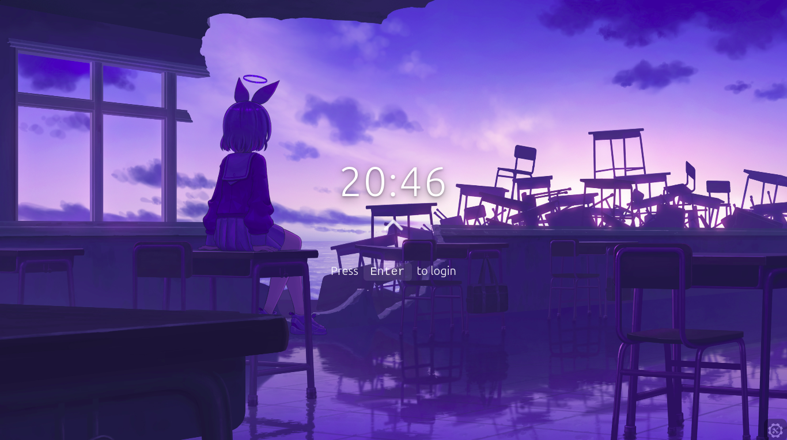
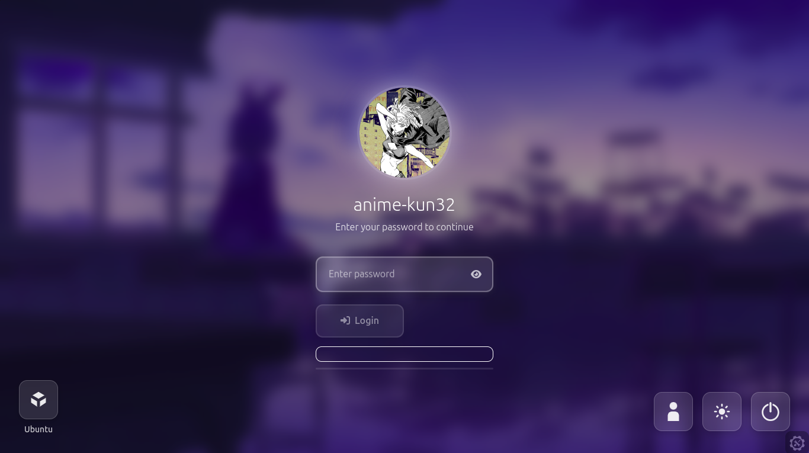

# Waifu Greeter

**Author:** anime-kun32  
**Version:** 1.0  
**License:** GPL-3.0  
**Description:** A Sexy Login UI for LightDM  

  

  
>  **Note:** Although the theme metadata lists battery and backlight features, they are **not implemented** in this .But... it will be included in the future releases hoepfully.

---

## Features
- Designed for lightdm
- styled with tailwind css , html and js


---

## Requirements

- LightDM >= 1.19.0  
- Web Greeter >= 3.2.0  
- **Recommended:** [Nody Greeter](https://github.com/JezerM/nody-greeter)  

---

## Installation

1. **Download or clone this repository** to your system:  
   ```bash
   git clone https://github.com/anime-kun32/waifu-greeter.git
   ```
   Or download as ZIP and extract it.

2. **Copy the theme folder** to your LightDM web greeter themes directory:  
   ```bash
   sudo cp -r waifu-greeter /usr/share/lightdm-web-greeter/themes/
   ```

3. **Set the theme in the web greeter configuration:**  
   Edit `/etc/lightdm/web-greeter.yml` and make sure it looks like this:  
   ```yaml
   theme: waifu-greeter
   secure_mode: False
   ```
   >  Make sure `secure_mode` is set to `False`, otherwise custom themes may not load properly.

4. **Restart LightDM** to apply changes:  
   This will log you out, so save your work!  
   ```bash
   sudo systemctl restart lightdm
   ```

5. **Enjoy your sexy login screen!**  

---


---

## Contributing

I went through HELL!! when building this so pull requests and suggestions are welcome! Keep it clean.. A star counts to this as well 
